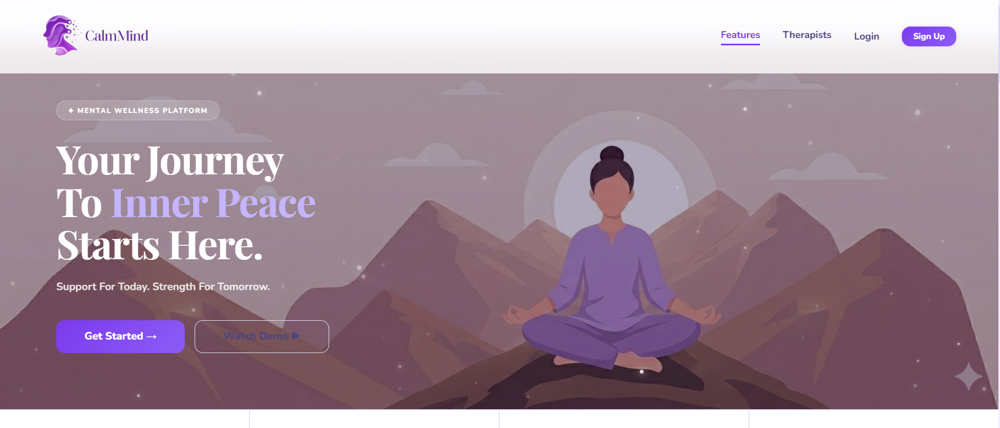
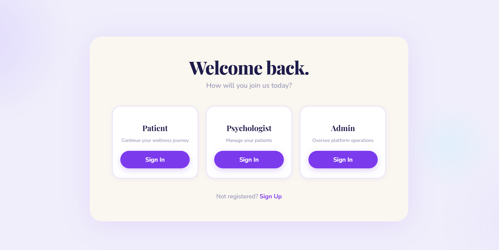
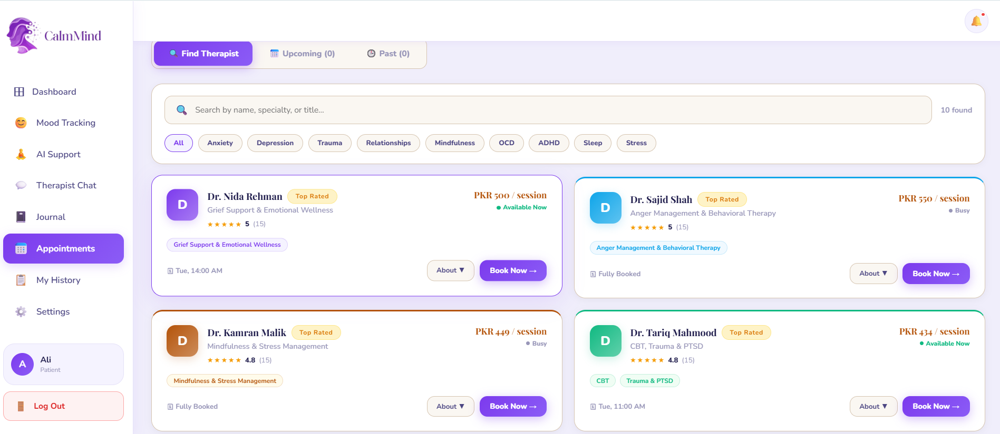
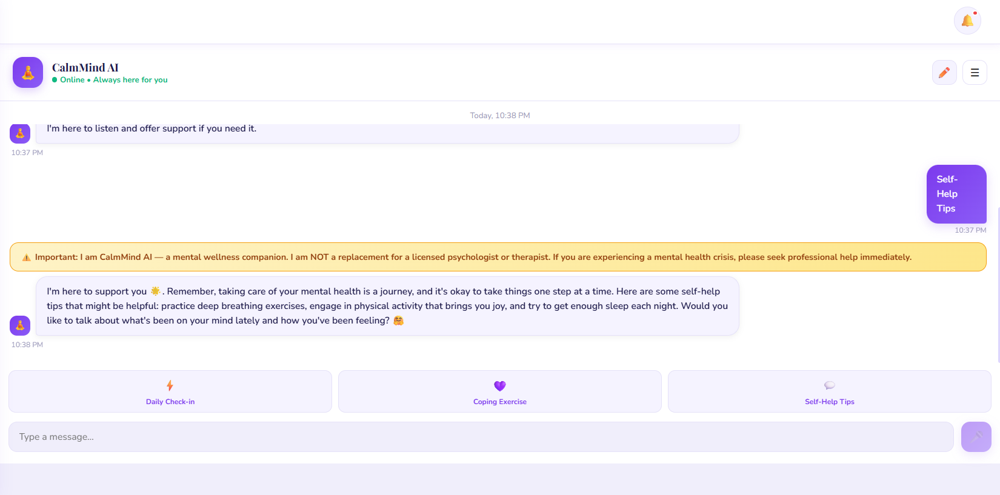

# 🧠 AI-Powered Mental Wellness Platform

An AI-powered web application that helps users monitor their mental well-being through mood tracking, private journaling, AI-powered conversations, and mental health resources—all within a secure and user-friendly platform.

---

## 📌 Problem Statement

Mental health challenges such as stress, anxiety, and depression often go unnoticed because many people hesitate to seek professional help due to stigma, cost, or lack of accessibility.

The **AI-Powered Mental Wellness Platform** provides an accessible first step by allowing users to:

- Track their emotional well-being
- Maintain a private digital journal
- Chat with an AI mental wellness assistant
- Explore self-care resources
- Build healthy habits over time

This platform is designed for:

- Students
- Working professionals
- Individuals experiencing daily stress
- Anyone interested in monitoring and improving their mental wellness

---

# 🌐 Live Demo

🔗 **Live Application:**

https://ai-powered-mental-wellness-platform.vercel.app/

---

# ✨ Features

## 🔐 User Authentication

- Secure Sign Up
- Login & Logout
- Protected Dashboard
- User-specific data

---

## 😊 Mood Tracking

- Log daily mood
- Select mood level
- Add optional notes
- View mood history
- Track emotional trends over time

---

## 📓 Private Journal

- Create journal entries
- Edit entries
- Delete entries
- Secure personal storage
- Reflect on thoughts and emotions

---

## 🤖 AI Mental Wellness Chatbot

Users can interact with an AI assistant that:

- Listens empathetically
- Offers emotional support
- Suggests healthy coping strategies
- Encourages mindfulness
- Provides stress-management techniques
- Helps users reflect on emotions

> **Note:** The chatbot is **not** a replacement for licensed mental health professionals.

---

## 📅 Appointment Interface

- View available appointments
- Book sessions
- Manage appointment information

---

## 🏆 Reward System

- Earn points for healthy habits
- Encourage consistency
- Increase engagement

---

## 📱 Responsive Design

- Desktop support
- Tablet support
- Mobile-friendly UI

---

# 🤖 AI Feature

## AI Mental Wellness Assistant

The application includes an AI-powered chatbot built using **Llama 3.3 70B** via the **Groq API**.

### What it does

The chatbot can:

- Answer mental wellness questions
- Encourage healthy routines
- Provide grounding exercises
- Suggest relaxation techniques
- Help users reflect on feelings
- Promote positive mental health habits

---

## Example System Prompt

```text
You are a compassionate and supportive AI Mental Wellness Assistant.

Your goal is to help users reflect on their emotions, encourage healthy coping strategies, and provide evidence-based mental wellness suggestions.

Always respond with empathy and kindness.

Avoid making medical diagnoses.

Do not claim to be a licensed therapist.

If a user expresses thoughts of self-harm, suicide, or immediate danger, encourage them to contact local emergency services or a trusted mental health professional immediately.

Keep responses supportive, respectful, and non-judgmental.
```

---

# 🛠️ Tech Stack

## Frontend

- React.js
- Next.js
- HTML5
- CSS3
- Tailwind CSS
- JavaScript

## Backend

- Node.js
- FastAPI
- REST APIs

## Database

- MySQL
- PostgreSQL

## AI Services

- Groq API
- Llama 3.3 70B

## Authentication

- JWT Authentication

## Deployment

- Vercel
- Render

## Version Control

- Git
- GitHub

---

# 📦 Tools & Services Used

| Tool | Purpose |
|-------|----------|
| VS Code | Development |
| Git | Version Control |
| GitHub | Repository Hosting |
| Vercel | Deployment |
| Groq API | AI inference |
| Llama 3.3 70B | Large Language Model |
| Postman | API Testing |
| MySQL | Database |
| PostgreSQL | Database |
| Tailwind CSS | Styling |

---

# 📸 Screenshots

## Home Page



---

## Login



---

## Appointments



---

## Chatbot



---

## Journal


---

# 🚀 Installation

## Clone the repository

```bash
git clone https://github.com/AyeshaNadeemgithub/AI-Powered-Mental-Wellness-Platform.git
```

Move into the project directory:

```bash
cd AI-Powered-Mental-Wellness-Platform
```

---

## Install dependencies

Frontend:

```bash
npm install
```

Backend:

```bash
pip install -r requirements.txt
```

---

## Configure Environment Variables

Create a `.env` file.

Example:

```env
GROQ_API_KEY=your_api_key
DATABASE_URL=your_database_url
JWT_SECRET=your_secret_key
```

---

## Run Frontend

```bash
npm run dev
```

---

## Run Backend

```bash
uvicorn main:app --reload
```

---

# 📁 Project Structure

```
AI-Powered-Mental-Wellness-Platform/
│
├── frontend/
├── backend/
├── screenshots/
├── public/
├── components/
├── pages/
├── api/
├── README.md
└── package.json
```

---

# 🎯 Future Improvements

- Emotion detection from text
- Voice interaction
- Daily wellness reminders
- Personalized wellness plans
- Mood analytics dashboard
- AI-generated journal summaries
- Emergency contact integration
- Multi-language support

---


# 📄 License

This project is developed for educational and portfolio purposes.
